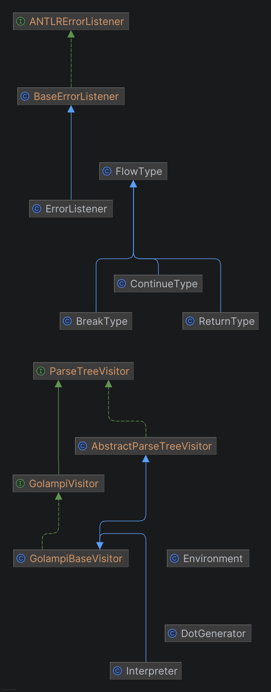

# Manual Técnico - Intérprete Golampi ⚡

**Universidad de San Carlos de Guatemala** **Facultad de Ingeniería - Escuela de Ciencias y Sistemas** **Compiladores 2** **Estudiante:** Pablo Alejandro - 201708993

---

## 1. Introducción
El presente documento detalla la arquitectura, el diseño y las decisiones de implementación del intérprete para el lenguaje **Golampi**. Este proyecto fue desarrollado utilizando **PHP 8** como lenguaje anfitrión y **ANTLR4** como generador de analizadores léxicos y sintácticos. El intérprete se ejecuta en un entorno web que permite la edición de código, visualización de consola, reporte de errores y renderizado del Árbol de Sintaxis Abstracta (AST) en tiempo real.

## 2. Arquitectura del Compilador
El ciclo de vida de ejecución de Golampi sigue el modelo clásico de un intérprete basado en árboles:

1.  **Entrada de Código:** El usuario ingresa el código fuente a través de la interfaz web (IDE).
2.  **Análisis Léxico (Scanner):** El `GolampiLexer` generado por ANTLR convierte la cadena de texto en una secuencia de Tokens.
3.  **Análisis Sintáctico (Parser):** El `GolampiParser` evalúa la secuencia de Tokens contra la gramática definida y construye un Árbol de Parseo (Parse Tree).
4.  **Análisis Semántico y Ejecución:** A través del patrón de diseño **Visitor**, la clase `Interpreter.php` recorre el árbol nodo por nodo. Durante este recorrido se validan tipos, se manejan ámbitos de memoria (Scopes) y se ejecutan las instrucciones en tiempo real.

## 3. Gramática y Herramientas (Golampi.g4)
La gramática central del lenguaje fue diseñada en ANTLR4.
* **Archivos generados:** El proceso de construcción genera las clases de contexto (`Context`), el Lexer y el Parser en el namespace `App\Generated`.
* **Tipos de datos soportados:** `int`, `float`, `string`, `bool`, `char`, `void`.
* **Estructuras de control:** Soporte nativo para `if-else`, ciclos `while` y `for`.
* **Funciones:** Soporte para declaración de funciones, paso de parámetros, sentencias `return` y recursividad.

## 4. Manejo de Memoria (Tabla de Símbolos)
El manejo de memoria se realiza a través de la clase `Environment.php`. Esta clase simula los **Ámbitos (Scopes)** del lenguaje.
* **Encadenamiento de Entornos:** Cada vez que se ingresa a un bloque `{ }` (como una función o un ciclo), se instancia un nuevo objeto `Environment` que guarda una referencia a su entorno padre.
* Esto permite que las variables locales "oculten" a las globales y que la memoria local se destruya al finalizar el bloque (recolección de basura natural de PHP), previniendo colisiones de nombres.

## 5. Patrón Visitor (El Intérprete)
En lugar de incrustar código de ejecución directamente en la gramática, se optó por una separación de responsabilidades usando el patrón **Visitor** (`Interpreter.php`).
* Cada regla gramatical (ej. `visitAsignacionStmt`, `visitWhileStmt`) tiene un método homólogo en el intérprete.
* **Control de Flujo:** Para manejar interrupciones como `break`, `continue` o `return`, el intérprete utiliza clases envoltorio (Wrapper Classes) que propagan una señal hacia arriba en el árbol de llamadas de PHP hasta ser interceptadas por el bloque controlador (ej. el ciclo `while`).

## 6. Reporte de Errores
Se implementó un sistema robusto de captura de errores para evitar fallos silenciosos:
* **Léxicos y Sintácticos:** Se inyectó un `ErrorListener` personalizado en ANTLR para interceptar tokens no reconocidos o estructuras mal formadas antes de la ejecución.
* **Semánticos:** Si una variable no está definida o hay una incompatibilidad en tiempo de ejecución, el intérprete lanza una Excepción (ej. `throw new \Exception(...)`) que es capturada por el controlador web para ser mostrada en la tabla de reportes.

## 7. Generación del AST
Para la visualización gráfica del código analizado, se diseñó la clase `DotGenerator.php`, la cual realiza un recorrido recursivo sobre el árbol de ANTLR y genera un script en formato **Graphviz (DOT)**. Posteriormente, la librería web `Viz.js` renderiza este script generando un gráfico vectorial interactivo en el navegador del usuario.

## 8. Gramática Formal de Golampi

A continuación se presenta la gramática formal del lenguaje, desarrollada con ANTLR4, definiendo las reglas léxicas y sintácticas utilizadas para la generación del Árbol de Parseo.

```antlr
grammar Golampi;

// Regla inicial
start : (instruccion | funcion)* EOF;

instrucciones : instruccion* ;
// Permite anidar código
bloque : '{' instrucciones '}' ;

// Tipos de datos soportados
tipos   : 'int' | 'float' | 'string' | 'bool' | 'char' | 'void' ;

// Definición: int suma(int a, int b) { ... }
funcion : tipos ID '(' parametros? ')' bloque  # FuncStmt ;

// Lista de parámetros: int a, string b
parametros : tipos ID (',' tipos ID)* ;

instruccion : 'print' '(' expr ')' ';'              # PrintStmt
            | 'if' '(' expr ')' bloque ('else' bloque)? # IfStmt
            | 'while' '(' expr ')' bloque           # WhileStmt
            | 'for' '(' instruccion expr ';' instruccion ')' bloque  # ForStmt
            
            // Variables y Asignaciones
            | tipos ID '=' expr ';'                 # DeclaracionStmt
            | ID '=' expr ';'                       # AsignacionStmt
            | expr '[' expr ']' '=' expr ';'        # AsignacionArrayStmt

            // Control de Flujo
            | 'break' ';'                           # BreakStmt
            | 'continue' ';'                        # ContinueStmt
            | 'return' expr? ';'                    # ReturnStmt

            | bloque                                # BloqueStmt
            | ID '(' (expr (',' expr)*)? ')' ';'    # CallStmt
            ;

expr : expr '[' expr ']'                      # ArrayAccess
     | NEW tipos ('[' expr ']')+              # ArrayNew
     | '{' (expr (',' expr)*)? '}'            # ArrayInit
     | ID '(' (expr (',' expr)*)? ')'         # Llamada
     | '!' expr                               # Not          // Nivel 1: Unario
     | '-' expr                               # Negacion     // Nivel 1: Unario (ej: -5)
     | expr op=('*'|'/'|'%') expr             # MulDiv       // Nivel 2: Multiplicación
     | expr op=('+'|'-') expr                 # AddSub       // Nivel 3: Suma
     | expr op=('<='|'>='|'<'|'>') expr       # Relational   // Nivel 4: Comparación
     | expr op=('=='|'!=') expr               # Equality     // Nivel 5: Igualdad
     | expr op='&&' expr                      # And          // Nivel 6: Lógica AND
     | expr op='||' expr                      # Or           // Nivel 7: Lógica OR
     | INT                                    # Int          // Valores primitivos
     | FLOAT                                  # Float
     | STRING                                 # String
     | CHAR                                   # Char
     | 'true'                                 # True
     | 'false'                                # False
     | ID                                     # Id
     | '(' expr ')'                           # Parens
     ;

NEW : 'new';
PRINT   : 'print';
IF      : 'if';

// Tipos primitivos
INT : [0-9]+ ;
FLOAT   : [0-9]+ '.' [0-9]+ ;
STRING  : '"' (~["\r\n\\] | '\\' .)* '"';
CHAR    : '\'' . '\'' ;
ID      : [a-zA-Z_][a-zA-Z0-9_]* ;

WS  : [ \t\r\n]+ -> skip ; // espacio en blanco
COMMENT : '//' ~[\r\n]* -> skip ;
BLOCK_COMMENT : '/*' (. | [\r\n])*? '*/' -> skip ;
```


## 9. Flujo de Procesamiento y Tabla de Símbolos

El flujo de procesamiento de Golampi sigue el modelo secuencial de un intérprete dirigido por sintaxis:

1. **Lectura y Análisis Léxico:** El código fuente ingresado en el frontend web (`index.php`) es convertido en un flujo de caracteres y procesado por el `GolampiLexer`, el cual lo transforma en una secuencia de Tokens.
2. **Análisis Sintáctico:** El `GolampiParser` recibe los Tokens, valida que cumplan con la gramática formal y construye el Árbol de Sintaxis Abstracta (Parse Tree). Si ocurre un error, el `ErrorListener` interrumpe el flujo y reporta la falla.
3. **Análisis Semántico e Interpretación:** La clase `Interpreter` aplica el patrón Visitor para recorrer el árbol. En cada nodo, se validan los tipos de datos, se resuelven operaciones matemáticas/lógicas y se ejecutan las sentencias.

### Gestión de Memoria (Tabla de Símbolos)
La "Tabla de Símbolos" está implementada en la clase dinámica `Environment`. Esta clase funciona mediante un sistema de **Ámbitos (Scopes) encadenados**.

* **Creación de Entornos:** Cada vez que el intérprete ingresa a un nuevo bloque de código (una función, un ciclo `for`, una instrucción `if`), se instancia un nuevo objeto `Environment`.
* **Referencia al Padre:** Este nuevo entorno guarda una referencia directa a su entorno padre.
* **Resolución de Variables:** Cuando se solicita una variable, el intérprete la busca primero en el entorno actual. Si no la encuentra, escala recursivamente al entorno padre hasta llegar al ámbito global. Si no existe en ningún nivel, arroja un error semántico.

**Representación abstracta de la memoria en ejecución:**

| Ámbito (Scope) | Nivel | Identificador | Tipo | Valor |
| :--- | :---: | :--- | :---: | :--- |
| `Global` | 0 | `matriz` | `int[][]` | `[Array]` |
| `Global` | 0 | `factorial` | `función` | `[Closure]` |
| ↳ `Local (Llamada Función)` | 1 | `n` | `int` | `5` |
| &nbsp;&nbsp;&nbsp;&nbsp;↳ `Local (Ciclo For)` | 2 | `i` | `int` | `0` |

Este diseño asegura que las variables locales se destruyan automáticamente al finalizar su bloque (liberando memoria) y previene la colisión de identificadores entre diferentes funciones.

## 10. Diagrama de Clases

La arquitectura orientada a objetos del intérprete se estructura separando la lógica de la gramática (generada por ANTLR) y la lógica de ejecución (implementada mediante el patrón Visitor).

