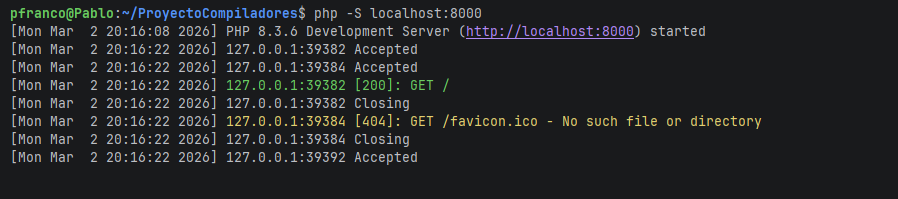
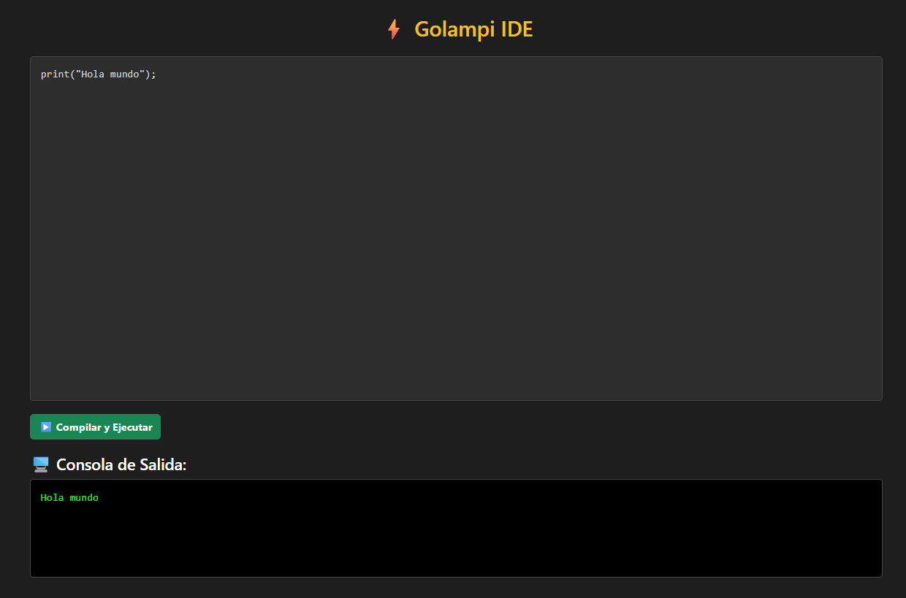
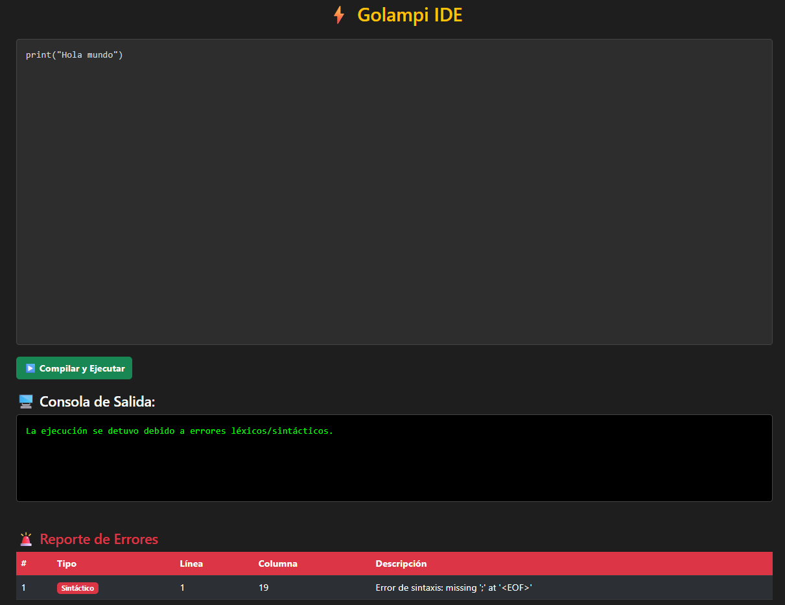
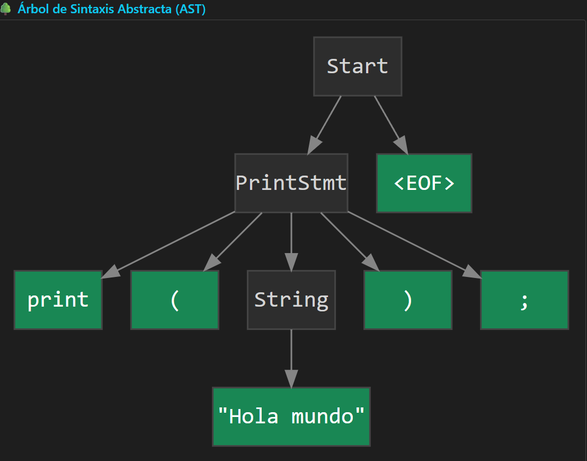
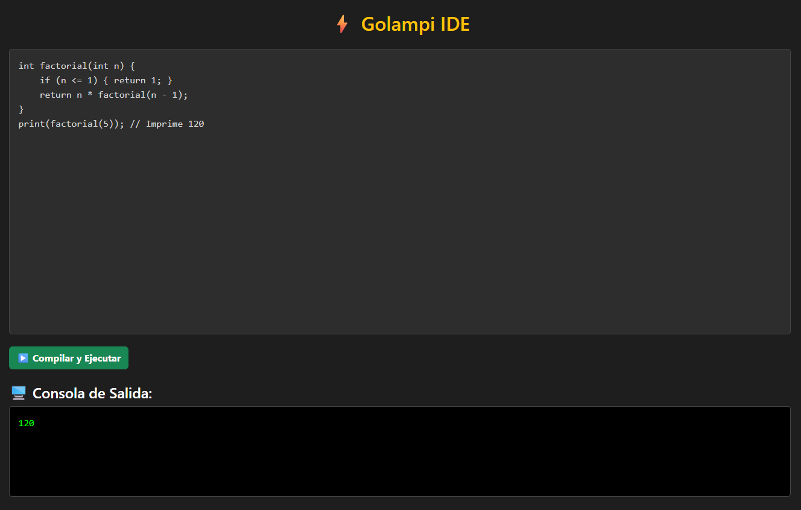

# Manual de Usuario - Golampi IDE ⚡

**Universidad de San Carlos de Guatemala** **Facultad de Ingeniería - Escuela de Ciencias y Sistemas** **Compiladores 2** **Estudiante:** Pablo Alejandro - 201708993

---

## 1. ¿Qué es Golampi IDE?
Golampi IDE es un entorno de desarrollo web integrado diseñado para escribir, compilar y ejecutar código escrito en el lenguaje **Golampi**. Ofrece una experiencia visual completa, incluyendo un editor de código, una consola de salida en tiempo real, reportes detallados de errores y la graficación automática del Árbol de Sintaxis Abstracta (AST).

## 2. Requisitos y Ejecución
Para hacer funcionar el IDE de Golampi en su máquina local, asegúrese de contar con:
* **PHP 8.0** o superior instalado en su sistema.
* Un navegador web moderno (Chrome, Firefox, Edge).

**Pasos para ejecutar:**
1. Abra una terminal en la carpeta raíz del proyecto.
2. Levante el servidor local de PHP ejecutando el siguiente comando:
   ```bash
   php -S localhost:8000
   ```
3. Abra su navegador web e ingrese a la dirección `http://localhost:8000`.




## 3. Interfaz Gráfica
El IDE está dividido en secciones claramente identificables para facilitar el flujo de trabajo:

1. **Editor de Código:** Un área de texto con numeración de líneas donde se ingresa el código fuente.
2. **Botón de Ejecución:** El botón verde "▶ Compilar y Ejecutar" que procesa el código.
3. **Consola de Salida:** Una pantalla oscura que simula una terminal real donde se imprimen los resultados de las funciones `print()`.

!

## 4. Manejo de Errores
Golampi cuenta con un sistema robusto para la detección de errores. Si el usuario comete una equivocación léxica, sintáctica o semántica, la ejecución se detendrá de manera segura y se desplegará una tabla informativa detallando:
* El tipo de error (Léxico, Sintáctico o Semántico).
* La línea y columna exacta del problema.
* Una descripción del fallo.

> 

## 5. Árbol de Sintaxis Abstracta (AST)
Al ejecutar un código libre de errores, el IDE generará automáticamente un diagrama interactivo en la parte inferior de la pantalla. Este diagrama representa la estructura jerárquica y lógica que el compilador entendió de su código.



## 6. Guía de Sintaxis de Golampi

A continuación, se presentan ejemplos de las estructuras soportadas por el lenguaje:

### 6.1. Variables y Tipos de Datos
Soporta `int`, `float`, `string`, `bool` y `char`.
```c
int edad = 25;
string mensaje = "Hola Mundo";
print(mensaje);
```

### 6.2. Estructuras de Control (If / Else)
```c
int nota = 85;
if (nota >= 61) {
    print("Aprobado");
} else {
    print("Reprobado");
}
```

### 6.3. Ciclos (While y For)
```c
// Ciclo For
for (int i = 0; i < 5; i = i + 1;) {
    print(i);
}
```

### 6.4. Arreglos Multidimensionales
```c
int[][] matriz = new int[2][2];
matriz[0][0] = 100;
print(matriz[0][0]);
```

### 6.5. Funciones y Recursividad
```c
int factorial(int n) {
    if (n <= 1) { return 1; }
    return n * factorial(n - 1);
}
print(factorial(5)); // Imprime 120
```
### Salida en consola
